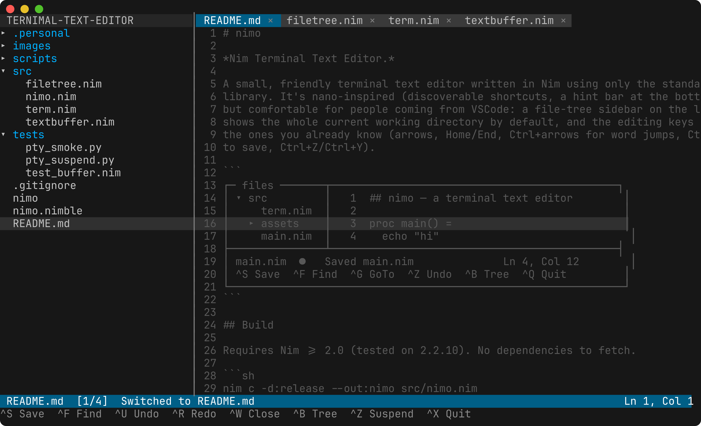

[English](README.md) · [日本語](README-ja.md) · 繁體中文 · [简体中文](README-zh.md) · [Deutsch](README-de.md) · [Français](README-fr.md)

# nimo

*以 Nim 撰寫的終端機文字編輯器。*

一個小巧、好上手的終端機文字編輯器，只使用 Nim 標準函式庫撰寫。它受 nano 啟發（快捷鍵容易發現，底部有提示列），同時也讓從 VSCode 過來的人感到順手：檔案樹側邊欄會顯示整個工作目錄，編輯器分頁排列在上方，並且可以用滑鼠點選檔案、切換分頁及放置游標。



## 功能

- 目前工作目錄的檔案樹側邊欄，預設即顯示。
- 帶有「已修改」圓點的編輯器分頁，可用滑鼠或 `Ctrl+W` 關閉；開啟的分頁多到放不下時，分頁列會橫向捲動。
- 滑鼠支援：點選檔案即可開啟、點選分頁即可切換，滾輪則捲動指標所在的窗格。
- 支援 UTF-8 的編輯、復原／重做，以及存檔點指示。
- 智慧大小寫搜尋、跳至指定行，以及以單字為單位移動游標。
- `Ctrl+Z` 暫停回到 shell，並可用 `fg` 乾淨地恢復。
- 不需外部函式庫，唯一的需求是 Nim 標準函式庫。

## 平台

Linux、macOS/BSD 與 Windows 共用同一份程式碼，只有 `term.nim` 不同。

| 平台 | 狀態 |
| --- | --- |
| Linux | 支援（已在 2.2.10 測試） |
| macOS / BSD | 支援（同一個 POSIX 後端） |
| Windows 10 1703+ | 支援（已在 10.0.19045 搭配 Nim 2.2.4 + mingw64 測試） |

在 Windows 上，主控台會切換到 VT 模式（`ENABLE_VIRTUAL_TERMINAL_INPUT` / `ENABLE_VIRTUAL_TERMINAL_PROCESSING`），因此能使用與 POSIX 終端機相同的跳脫序列，整個解碼器也得以共用。不過在 Windows 上，以下差異無法避免：

- `Ctrl+Z` 暫停需要工作控制（job control），而 Windows 沒有對應的機制。按下此鍵會提示無法使用，提示列則改為顯示 `^G Goto`。
- 視窗大小的變更是以輪詢偵測，而不是透過 `SIGWINCH` 通知。
- 無法使用括號貼上（bracketed paste）：舊版主控台從未實作這項功能，而 ConPTY 會移除標記，因此貼上的內容會以一般按鍵的形式送達。貼上本身仍然很快（輸入迴圈會在重繪前一次讀完整批輸入），但每個貼上的字元都是獨立的復原步驟，所以貼上後按 `Ctrl+U` 會一次復原一個字元，而不是整段貼上的內容。

建議使用 Windows Terminal，而不是舊版主控台主機，尤其是為了滑鼠支援。所有平台上的檔案都以 `\n` 換行寫入。

## 建置

需要 Nim >= 2.0（已在 2.2.10 測試）。沒有需要下載的相依套件。

```sh
nim c -d:release --out:nimo src/nimo.nim
```

或透過 nimble：

```sh
nimble build          # 產生 ./nimo
nimble run            # 建置並開啟目前目錄
```

## 執行

```sh
./nimo                # 以目前目錄為根目錄開啟編輯器
./nimo path/file      # 開啟（或建立）指定的檔案
```

## 按鍵綁定

### 全域
| 按鍵 | 動作 |
| --- | --- |
| `Ctrl+S` | 儲存（若緩衝區尚未命名，會詢問名稱） |
| `Ctrl+X` | 離開（`Ctrl+Q` 亦可；若有未儲存的內容會要求確認） |
| `Ctrl+B` | 切換檔案樹側邊欄 |
| `Ctrl+O` | 將焦點移到檔案樹，以瀏覽並開啟檔案 |
| `Ctrl+Z` | 暫停回到 shell（以 `fg` 恢復；僅限 POSIX） |
| `Shift+Tab` | 在編輯器與檔案樹之間切換焦點 |

### 編輯器窗格
| 按鍵 | 動作 |
| --- | --- |
| 方向鍵 / `Home` / `End` | 移動游標 |
| `Ctrl+←` / `Ctrl+→` | 以單字為單位移動 |
| `Ctrl+Home` / `Ctrl+End` | 跳到檔案開頭／結尾 |
| `PageUp` / `PageDown` | 捲動一個畫面 |
| `Ctrl+F` | 搜尋（智慧大小寫；`Ctrl+N` 重複上一次搜尋） |
| `Ctrl+G` | 跳至指定行號 |
| `Ctrl+U` / `Ctrl+R` | 復原／重做（`Ctrl+Y` 也可重做） |
| `Ctrl+A` / `Ctrl+E` | 行首／行尾（nano 風格） |
| `Ctrl+W` | 關閉目前的分頁 |
| `Ctrl+PageUp` / `Ctrl+PageDown` | 切換到上一個／下一個分頁 |

### 檔案樹窗格
| 按鍵 | 動作 |
| --- | --- |
| `↑` / `↓` | 移動選取項目 |
| `→` / `←` | 展開／收合資料夾（或進入／離開資料夾） |
| `Enter` | 開啟檔案，或展開／收合資料夾 |
| `n` | 在選取的資料夾中建立新檔案 |
| `r` / `F5` | 從磁碟重新整理檔案樹 |
| `Tab` | 將焦點移回編輯器 |

### 滑鼠
| 操作 | 結果 |
| --- | --- |
| 點選檔案樹項目 | 開啟檔案，或展開／收合資料夾 |
| 點選分頁 | 切換到該分頁；點選其 `×` / `●` 標記可關閉 |
| 點選 `‹` / `›` 箭頭 | 分頁列溢出時捲動分頁列 |
| 點選文字內 | 將游標放在該處 |
| 滾輪 | 捲動指標下方的檔案樹、文字或分頁列 |

## 設計說明

程式碼分為四個模組。`term.nim` 負責原始模式（raw mode）、按鍵與滑鼠解碼、括號貼上、視窗大小變更以及暫停回 shell；它將兩種平台後端（POSIX 上的 termios／訊號、Windows 上的主控台 API）包在同一個介面之後，跳脫序列解碼器則由兩者共用。`textbuffer.nim` 是編輯核心：支援 UTF-8，包含展開 Tab 後的顯示位置計算、復原／重做紀錄以及智慧大小寫搜尋。`filetree.nim` 是延遲載入並快取的側邊欄模型。`nimo.nim` 則以繪製與輸入迴圈將它們串接起來。

每個開啟的檔案都是獨立的緩衝區，擁有各自的游標與捲動位置。從檔案樹開啟一個已開啟的檔案時，會直接切換到它的分頁，因此不會在你不知情的情況下丟棄任何內容。游標移動、刪除與水平捲動都以完整字元（rune）及其在螢幕上的顯示欄寬計算；狀態列中的「已修改」圓點會精確追蹤存檔點，因此復原到存檔點時圓點就會消失。看起來是二進位檔或超過 20 MB 的檔案會被拒絕開啟，以免被損毀。

## 測試

```sh
nim c -r tests/test_buffer.nim   # 編輯核心的單元測試
python3 tests/pty_smoke.py       # 透過 pty 操作實際的 TUI
python3 tests/pty_suspend.py     # 檢查 Ctrl+Z 暫停／恢復
```

前兩項會在 CI 中執行。`pty_suspend.py` 僅在本機執行，因為 POSIX 會丟棄傳送給孤立行程群組的 `SIGTSTP`，所以在沒有互動式工作階段的 CI 執行器上，Ctrl+Z 無法停止行程。

## 螢幕截圖

上方的圖片是用 `scripts/screenshot.sh` 從本儲存庫產生的：它在 tmux 窗格中操作 nimo，再用 [freeze](https://github.com/charmbracelet/freeze) 繪製擷取到的畫面。

<!-- BEGIN gh-mutual-linking -->

---

### Related projects

- [lpchart](https://github.com/didvc/lpchart): Chart InfluxDB line protocol in your terminal. Browse measurements, fields and tag sets interactively without knowing what is in the file first.
- [totp](https://github.com/tui-apps/totp): Terminal TOTP authenticator: live 2FA codes with countdown (RFC 6238, Go, Bubble Tea)
- [calc](https://github.com/tui-apps/calc): Live terminal calculator: evaluates arithmetic as you type, no Enter key (Go, Bubble Tea)
- [note-cli](https://github.com/didvc/note-cli): Markdown Indexing and Pcre Regular Expression Compatible Full Text Searching for Advanced Note Takers.
<!-- END gh-mutual-linking -->
